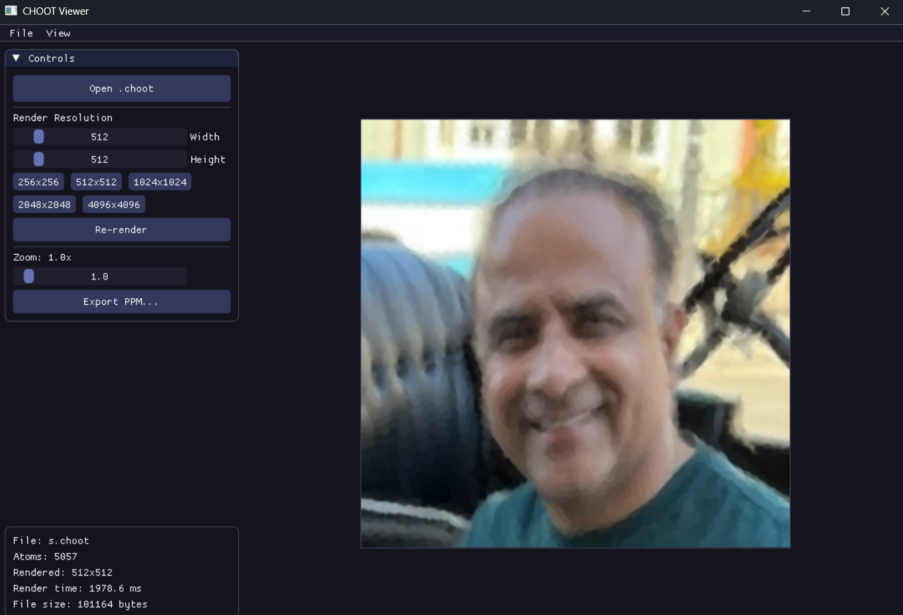

IDFC about the name, its fucking given by [epicguest97](https://github.com/Epicguest97).
# CHOOT

This repo is a full reference implementation of CHOOT, an experimental continuous image format based on anisotropic 2D Gaussian splat atoms. There is no pixel grid stored in the file. Decoders evaluate the field at any resolution.

I wrote this in a plain, practical way. It is deterministic and not ML based. It does what it says, no extra stuff.

## Why the name is CHOOT
I was not able to come up with a name when [epicguest97](https://github.com/Epicguest97) said choot. So that became the placeholder name and it stuck.

## What this format is, in real terms
This format stores a list of splats. Each splat is a 2D Gaussian with color. There is no pixel grid. When you render, you pick an output size, then evaluate the field at every pixel. That means:
- you can render at any resolution
- you do not have a fixed native size
- rendering cost scales with $N_{pixels} \times N_{atoms}$

If you want the exact byte layout, use [SPEC.md](SPEC.md). That is the source of truth.

## Repo map
- Spec and format details: [SPEC.md](SPEC.md)
- Core library (file IO, f16, color conversion): [src/choot.h](src/choot.h) and [src/choot.c](src/choot.c)
- CPU renderer (reference rasterizer): [src/choot_render.h](src/choot_render.h) and [src/choot_render.c](src/choot_render.c)
- PNG to CHOOT encoder (Windows WIC): [tools/png2choot.c](tools/png2choot.c)
- CHOOT to PPM raster tool: [tools/choot_raster.c](tools/choot_raster.c)
- Tests: [tests/choot_tests.c](tests/choot_tests.c)
- Win32 + OpenGL viewer: [viewer/viewer.c](viewer/viewer.c)
- Python viewer (uses choot_raster.exe): [viewer/choot_viewer.py](viewer/choot_viewer.py)

## File format details
### Header
The header is fixed at 24 bytes and is fully described in [SPEC.md](SPEC.md). It contains:
- magic string
- version
- flags
- atom count
- header size
- reserved

### Atom layout
Each atom is exactly 20 bytes. It stores:
- center (x, y) in normalized coordinates
- covariance (sxx, sxy, syy)
- alpha
- color in linear YCoCg
- per-atom flags

All fields are little-endian. Atoms are stored in f16 to keep files small. See [SPEC.md](SPEC.md) for the exact byte offsets and validation rules.

## Math and rendering
Each atom defines a 2D Gaussian with covariance $\Sigma$ and opacity $\alpha$. For a sample point $p$:

$$
G = \exp\left(-\tfrac{1}{2} (p-c)^T \Sigma^{-1} (p-c)\right)
$$

Each atom contributes $w = \alpha G$. Accumulate premultiplied radiance:

$$
C_{sum} = \sum w C_{atom}, \quad A_{sum} = \sum w
$$

Then normalize:

$$
C_{final} = \frac{C_{sum}}{\max(A_{sum}, \epsilon)}
$$

The renderer uses $\epsilon = 1e{-8}$. The accumulation order does not matter, which makes it deterministic and easy to parallelize.

### Color model
Color is stored in linear YCoCg and converted to linear RGB at decode time, then to sRGB for 8-bit output. The transform is round-trip safe:

$$
Y = 0.25r + 0.5g + 0.25b,
\quad Co = 0.5r - 0.5b,
\quad Cg = -0.25r + 0.5g - 0.25b
$$

Inverse:

$$
r = Y + Co - Cg,
\quad g = Y + Cg,
\quad b = Y - Co - Cg
$$

If you are implementing another decoder, use the same math to avoid color drift.

## Encoder pipeline (png2choot)
The encoder in [tools/png2choot.c](tools/png2choot.c) is multi-stage. The short version:
1. Load PNG using WIC (Windows only).
2. Build a 5D feature for each pixel: (x, y, r, g, b) with a spatial weight.
3. k-means++ seeding, then Lloyd iterations to get clusters.
4. Fit Gaussian covariances and atom colors from clusters.
5. Soft color refit to match how the renderer blends.
6. Error-driven splitting to add detail where it matters.
7. Final soft refit at full resolution.

Important detail: color is stored in YCoCg, and the encoder uses linear RGB for all math. That keeps the math consistent with the renderer in [src/choot_render.c](src/choot_render.c).

## Renderer details
The renderer in [src/choot_render.c](src/choot_render.c) is a direct CPU reference. It evaluates every atom at every pixel, which is expensive but simple and correct. It also has OpenMP parallel loops for speed where possible.

Complexity is roughly:

$$
O(N_{pixels} \times N_{atoms})
$$

That is the reason large outputs get slow. This is a reference implementation, not a GPU splat renderer.

## Build (Windows, MSVC)
From the repo root, run build.bat. It builds png2choot.exe, choot_raster.exe, and choot_tests.exe.

Manual compile commands:
- Build choot_raster.exe with cl /O2 /W4 /I src tools\choot_raster.c src\choot.c src\choot_render.c
- Build png2choot.exe with cl /O2 /W4 /I src tools\png2choot.c src\choot.c src\choot_render.c src\wic_png.c /link windowscodecs.lib ole32.lib

The Windows PNG path uses WIC, so no extra image libraries are required on Windows.

## Tools and how to use them
### png2choot.exe
Converts PNG to CHOOT. Default settings are balanced for quality and speed.

Usage:
- png2choot input.png output.choot
- png2choot input.png output.choot hq
- png2choot input.png output.choot fast
- png2choot input.png output.choot atoms=10000 max_atoms=40000 sharp=1.6 sample=1

Encoder parameters:
- atoms (default 5000): initial k-means clusters
- max_atoms (default 40000): upper bound after splits
- spatial (default 2.0): position vs color weight in the 5D feature space
- sharp (default 1.2): covariance scaling, >1 = sharper splats
- refine (default 6): number of split passes
- split (default 30): percent of atoms to split per pass
- iters (default 50): Lloyd iterations per stage
- sample (default 2): pixel sampling stride during refinement (1 = full)
- fast / hq: presets

### choot_raster.exe
Rasterizes a .choot to PPM at a chosen resolution.

Usage:
- choot_raster input.choot output.ppm 1024 1024
- choot_raster input.choot output.ppm 1024 1024 --p3

The --p3 flag writes ASCII PPM for basic web viewers.

## Viewer options

### C viewer (Win32 + OpenGL + ImGui)
Source is in [viewer/viewer.c](viewer/viewer.c). Build with viewer/build.bat after running viewer/setup.ps1 (that script downloads ImGui). This viewer renders in the background and keeps UI responsive.

If the C viewer is too heavy or you want the simplest path, use the Python viewer instead.

### Python viewer (simple, portable)
Use [viewer/choot_viewer.py](viewer/choot_viewer.py). It calls choot_raster.exe to generate PPM, then shows it in a Tkinter window with zoom and pan. This is the easiest viewer if you just want to see the output.

## Tests
Run choot_tests.exe. Tests cover:
- file IO validation
- f16 conversions
- YCoCg round-trip
- deterministic rendering

## Why you might see .obj files
MSVC always compiles .c files into .obj first, then links into .exe. If the link step fails, you are left with .obj files only. That is normal.

## Known limitations
- Rendering is CPU-only.
- Output quality depends on atom count and refinement settings.
- Very large resolutions can be slow because the renderer is $O(N_{pixels} \times N_{atoms})$.

## File layout overview
- root build.bat: build core tools
- viewer/build.bat: build the C viewer
- viewer/setup.ps1: fetch ImGui
- tools/: encoder and raster tool
- src/: core library and renderer
- tests/: unit tests
